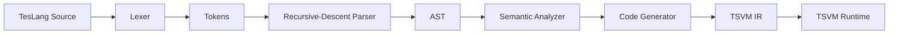

# TesLang Compiler

TesLang Compiler is a handwritten compiler built to explore how a programming language moves from source code through lexical analysis, parsing, semantic analysis, and target-code generation.

The compiler includes a handwritten lexer, recursive-descent parser, abstract syntax tree, scoped symbol tables, semantic and type analysis, and a backend targeting the TSVM virtual machine.

The core compiler stages are implemented manually without parser generators or compiler frameworks.

## Compiler Pipeline



## Highlights

- handwritten lexical analyzer with source-position tracking and nested comments
- recursive-descent parser with explicit operator-precedence levels
- abstract syntax tree shared by semantic analysis and code generation
- nested lexical scopes and symbol-table-based name resolution
- type checking, definite-assignment checks, function validation, and return-path analysis
- AST visitor-based TSVM code generation
- preserved incremental Git history with tagged implementation milestones
- reproducible end-to-end smoke test

## Support Status

The compiler frontend recognizes a broader TesLang language surface than the currently verified TSVM backend.

| Feature Area | Status |
|---|---|
| Integer literals and variables | Verified end-to-end |
| Variable declarations and assignments | Verified end-to-end |
| Integer arithmetic | Verified end-to-end |
| Straight-line functions and calls | Verified end-to-end |
| Terminal return values | Verified end-to-end |
| Integer output | Verified end-to-end |
| Comparisons and control flow | Frontend supported, backend partial |
| Unary, logical, and ternary expressions | Frontend supported, backend incomplete |
| Strings and multiline strings | Frontend supported, backend incomplete |
| Vectors and indexing | Frontend supported, backend incomplete |
| Nested function declarations | Parser supported, semantic/backend support incomplete |

The verified example in `examples/sample.teslang` compiles to TSVM IR and executes successfully on the TSVM runtime.

For the detailed language surface and backend support matrix, see the project documentation.

## Quick Start

### Requirements

Compiling TesLang source code requires:

- Python 3

Executing generated code additionally requires:

- a C compiler such as GCC or Clang
- `make`
- TSVM

The compiler itself has no external Python dependencies.

### Compile a TesLang Program

From the repository root:

```bash
python3 compiler/main.py < examples/sample.teslang
```

Generated TSVM IR is written to:

```text
output.tsl
```

A checked-in reference output is available at:

```text
examples/sample.tsl
```

### Build TSVM

TSVM is maintained separately from this compiler.

Clone the upstream runtime into the repository directory:

```bash
git clone https://github.com/aligrudi/tsvm.git tsvm
```

Build it:

```bash
make -C tsvm
```

The local `tsvm/` directory is intentionally ignored by Git.

### Execute the Generated Program

```bash
./tsvm/tsvm output.tsl
```

The complete workflow is:

```text
TesLang source
      ↓
TesLang Compiler
      ↓
TSVM IR
      ↓
TSVM Runtime
      ↓
Program output
```

For the included sample:

```bash
python3 compiler/main.py < examples/sample.teslang
./tsvm/tsvm output.tsl
```

Expected output:

```text
436
```

## Example

```text
funk <int> sum(a as int, b as int) {
    return a + b;
}

funk <null> main() {
    x :: int = 5;
    y :: int = 31;

    print(356 + 44 + sum(x, y));
}
```

The generated reference IR is available in [`examples/sample.tsl`](examples/sample.tsl).

## Testing

Run the end-to-end smoke test with:

```bash
./scripts/smoke-test.sh
```

The test verifies that:

1. the Python compiler modules compile,
2. the sample TesLang source compiles successfully,
3. the generated IR matches the checked-in reference output,
4. when TSVM is available, the program executes and produces `436`.

The same verification is run automatically through GitHub Actions.

## Project Structure

```text
teslang-compiler/
├── compiler/               # compiler implementation
│   ├── lexer.py
│   ├── parser.py
│   ├── teslang_ast.py
│   ├── semantic_analyzer.py
│   ├── symbol_table.py
│   ├── code_generator.py
│   ├── tokens.py
│   └── main.py
├── examples/               # source and reference TSVM IR
├── docs/                   # language and architecture documentation
├── scripts/                # local verification scripts
├── .github/workflows/      # continuous integration
├── .gitignore
└── README.md
```

## Documentation

Detailed documentation is kept outside the README:

- [TesLang Language Specification](docs/language-spec.md) — syntax, types, expressions, functions, scopes, control flow, vectors, built-ins, and semantic rules
- [Compiler Architecture](docs/compiler-architecture.md) — compiler stages, AST design, symbol tables, semantic analysis, register allocation, TSVM lowering, and backend support

## Project History

The repository preserves the original incremental development history of the compiler.

| Milestone | Scope |
|---|---|
| `lexer-complete` | Lexical analysis, tokens, literals, operators, and nested comments |
| `frontend-complete` | Recursive-descent parsing, AST construction, symbol tables, scopes, and semantic analysis |
| `compiler-complete` | Initial TSVM-targeted code-generation implementation |

The current `main` branch builds on those milestones with repository cleanup, documentation, verification, and portfolio presentation while keeping the original implementation history intact.

## TSVM

[TSVM](https://github.com/aligrudi/tsvm) is an external register-based virtual machine used as the execution target for generated TesLang programs.

TSVM itself is not implemented as part of this repository. This project focuses on the compiler pipeline that translates TesLang source code into TSVM-compatible intermediate representation.

## License

This project is available under the [MIT License](LICENSE).
