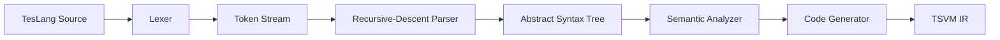

# TesLang Compiler

A handwritten compiler for TesLang, built to explore how source code is transformed through the major stages of a compiler pipeline.

The compiler implements lexical analysis, recursive-descent parsing, AST construction, semantic analysis, scoped symbol management, and code generation targeting the TSVM intermediate representation.

The core compiler stages are implemented manually without parser generators or compiler frameworks.

## Compiler Pipeline



## Features

### Lexical Analysis

- Tokenization of TesLang source code
- Keyword, identifier, operator, and literal recognition
- Source line and column tracking
- Nested comment handling

### Parsing

- Handwritten recursive-descent parser
- Operator precedence handling
- AST construction
- Function declarations and calls
- Variable declarations and assignments
- Conditional statements
- `while`, `do-while`, and `for` loops
- Arrays and array access
- Unary and binary expressions
- Ternary expressions

### Semantic Analysis

- Nested lexical scopes
- Symbol tables
- Variable and function resolution
- Type checking
- Function argument validation
- Duplicate declaration detection
- Undefined variable detection
- Use-before-assignment detection
- Function return validation
- Entry-point validation

### Code Generation

- AST-based code generation
- Register-oriented intermediate code
- Arithmetic and comparison operations
- Branch and loop generation
- Function calls and return values
- Array access
- TSVM-targeted intermediate representation

## Project Structure

```text
teslang-compiler/
├── compiler/
│   ├── main.py
│   ├── lexer.py
│   ├── tokens.py
│   ├── parser.py
│   ├── teslang_ast.py
│   ├── symbol_table.py
│   ├── semantic_analyzer.py
│   └── code_generator.py
│
├── examples/
│   ├── sample.teslang
│   └── sample.tsl
│
├── .gitignore
└── README.md
```

## Running the Compiler

The project has no external Python dependencies.

Compile a TesLang program by passing the source through standard input:

```bash
python compiler/main.py < examples/sample.teslang
```

The generated TSVM intermediate code is written to:

```text
output.tsl
```

`output.tsl` is intentionally ignored by Git because it is generated output.

A reference output is available at:

```text
examples/sample.tsl
```

## Example

Input:

```text
funk <int> sum(a as int, b as int) {
    return a + b;
}

funk <null> main() {
    x :: int = 5;
    y :: int = 31;
    print(356 + 44 + sum(x , y));
}
```

Generated TSVM IR begins with:

```text
proc sum
mov r3, r1
mov r4, r2
mov r2, r3
mov r15, r4
add r14, r2, r15
mov r0, r14
ret
```

## TSVM

The compiler targets TSVM, a small register-based virtual machine used to execute the generated intermediate representation.

TSVM itself is an external runtime and is not included in this repository. This repository focuses on the compiler pipeline and generation of TSVM-compatible IR.

## Implementation Evolution

The compiler was developed incrementally, with each stage extending the previous implementation.

### Lexical Analysis

The initial implementation focused on tokenization, source-position tracking, literal recognition, and comment handling.

### Compiler Frontend

The next stage introduced a recursive-descent parser, AST construction, scoped symbol tables, and semantic validation.

### Code Generation

The final stage added AST-driven code generation targeting TSVM's register-based intermediate representation.

Earlier implementation milestones remain available through the Git history and repository tags.

## Motivation

Compiler construction combines several areas of computer science that are often encountered separately: grammars, parsing, tree-based representations, scope resolution, type systems, control flow, and low-level execution models.

I built TesLang Compiler to develop a practical understanding of how these components interact inside a complete language-processing pipeline. Implementing the major stages manually made it possible to explore the design decisions behind tokenization, recursive-descent parsing, semantic validation, AST traversal, symbol resolution, and code generation.