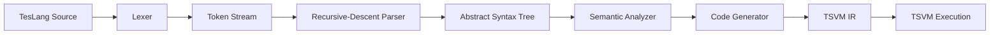

# TesLang Compiler

A handwritten compiler for TesLang, built to explore how source code is transformed through the major stages of a compiler pipeline.

The compiler implements lexical analysis, recursive-descent parsing, AST construction, semantic analysis, scoped symbol management, and code generation targeting the TSVM intermediate representation.

The core compiler stages are implemented manually without parser generators or compiler frameworks.

## Compiler Pipeline



## Features

### Lexical Analysis

- Tokenization of TesLang source code
- Keyword, identifier, operator, and literal recognition
- Source line and column tracking
- Nested comment handling

### Parsing

- Handwritten recursive-descent parser
- Operator precedence handling
- AST construction
- Function declarations and calls
- Variable declarations and assignments
- Conditional statements
- `while`, `do-while`, and `for` loops
- Arrays and array access
- Unary and binary expressions
- Ternary expressions

### Semantic Analysis

- Nested lexical scopes
- Symbol tables
- Variable and function resolution
- Type checking
- Function argument validation
- Duplicate declaration detection
- Undefined variable detection
- Use-before-assignment detection
- Function return validation
- Entry-point validation

### Code Generation

- AST-based code generation
- Register-oriented intermediate code
- Arithmetic and comparison operations
- Branch and loop generation
- Function calls and return values
- Array access
- TSVM-targeted intermediate representation

## Project Structure

```text
teslang-compiler/
├── compiler/
│   ├── main.py
│   ├── lexer.py
│   ├── tokens.py
│   ├── parser.py
│   ├── teslang_ast.py
│   ├── symbol_table.py
│   ├── semantic_analyzer.py
│   └── code_generator.py
│
├── examples/
│   ├── sample.teslang
│   └── sample.tsl
│
├── .gitignore
└── README.md
```

## Quick Start

### Requirements

- Python 3
- A C compiler such as GCC or Clang
- `make`
- TSVM for executing the generated intermediate code

The compiler itself has no external Python dependencies.

### 1. Compile a TesLang Program

Run the compiler from the repository root:

```bash
python compiler/main.py < examples/sample.teslang
```

The compiler writes the generated TSVM intermediate representation to:

```text
output.tsl
```

A reference generated output is also available at:

```text
examples/sample.tsl
```

### 2. Get TSVM

TSVM is a separate register-based virtual machine used as the execution target of this compiler.

Clone it next to or inside your local project workspace:

```bash
git clone https://github.com/MostafaNasrollahpour/tsvm.git tsvm
```

Build the virtual machine:

```bash
cd tsvm
make
cd ..
```

This creates the executable:

```text
tsvm/tsvm
```

### 3. Execute the Generated Program

After compiling a TesLang source file, execute the generated IR with:

```bash
./tsvm/tsvm output.tsl
```

The complete flow is therefore:

```text
TesLang source
      ↓
TesLang Compiler
      ↓
output.tsl
      ↓
TSVM
      ↓
Program output
```

For example:

```bash
python compiler/main.py < examples/sample.teslang
./tsvm/tsvm output.tsl
```

## Example

Input:

```text
funk <int> sum(a as int, b as int) {
    return a + b;
}

funk <null> main() {
    x :: int = 5;
    y :: int = 31;
    print(356 + 44 + sum(x , y));
}
```

Generated TSVM IR begins with:

```text
proc sum
mov r3, r1
mov r4, r2
mov r2, r3
mov r15, r4
add r14, r2, r15
mov r0, r14
ret
```

## TSVM Runtime

TesLang Compiler generates intermediate code for **TSVM**, a small register-based virtual machine.

A TSVM program consists of procedures and virtual registers such as `r0`, `r1`, and `r2`. Execution starts from a procedure named `main`.

The generated instruction set includes operations such as:

```text
mov   add   sub   mul   div   mod
cmp<  cmp>  cmp== cmp<= cmp>=
ld    st
call  ret
jmp   jz    jnz
```

TSVM also provides runtime procedures used by generated programs, including integer input/output and memory allocation.

TSVM is maintained as a separate project and is intentionally not included in this repository:

[TSVM Repository](https://github.com/MostafaNasrollahpour/tsvm)

This repository focuses on translating TesLang source code into TSVM-compatible intermediate representation.

## Implementation Evolution

The compiler was developed incrementally, with each stage extending the previous implementation.

### Lexical Analysis

The initial implementation focused on tokenization, source-position tracking, literal recognition, and comment handling.

### Compiler Frontend

The next stage introduced a recursive-descent parser, AST construction, scoped symbol tables, and semantic validation.

### Code Generation

The final stage added AST-driven code generation targeting TSVM's register-based intermediate representation.

Earlier implementation milestones remain available through the Git history and repository tags.

## Motivation

Compiler construction combines several areas of computer science that are often encountered separately: grammars, parsing, tree-based representations, scope resolution, type systems, control flow, and low-level execution models.

I built TesLang Compiler to develop a practical understanding of how these components interact inside a complete language-processing pipeline. Implementing the major stages manually made it possible to explore the design decisions behind tokenization, recursive-descent parsing, semantic validation, AST traversal, symbol resolution, and code generation.